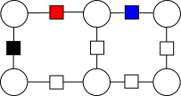

---

---

# 条件随机场简介

## 1.概要

概率图模型是重要的人工智能技术，而条件随机场是入门路径之一。本文从入门的角度来写，尽量简明扼要，但也不想泛泛而谈，而是希望提供一种叫“条件随机场”的思考手段。如还能帮助大家动手实践，那自然再好不过。

## 2.思考的起点

“probabilistic graphical model -- principles and techniques”一书（有中文版），从三个方面来理解智能系统：**表达**、**推理**和**学习**。表达就是模型，推理就是对模型求解，而学习是确定模型的参数。这三位一体的理解方法，我深以为然。

智能系统的任务就是处理已知信息，推理出新的信息。 任何信息的形式都是“**变量=值**”。为简单起见，且不失一般性，假设所有的已知变量为$$\{X_1,X_2,\cdots,X_N\}$$，而未知变量为$$\{Y_1,Y_2,\cdots,Y_M\}$$。下标也可以是字母，如$$X_i$$表示编号为$$i$$的变量。 已知的$$X$$变量又称为**输入变量**，而未知的$$Y$$称为**输出变量**。 

我们只考虑**离散**型的变量，就是说，$$X$$和$$Y$$的值只能是$$0,1,2,\cdots$$这样的整数。我们记$$X$$可能的取值有$$S$$个，而$$Y$$的是$$O$$个。 

变量的值一般用对应的小写字母表示，如$$\{x_1,x_2,\cdots,x_N\}$$。如要从整体来考虑变量及其值，那就把下标去掉好了，但小写字母要改成粗体，分别如$$X, \pmb x$$。

> *用字母表示“变量”是好理解的，为何要用另一个字母来表示其值呢？其实，这要考虑到文档书写与编程的语境的不同。在书写公式时，变量并没有实际的值，那一条信息只能写成$$X=\pmb x$$的形式。理解这些符号的微小区别，对初学者阅读数学类书籍很有必要，尤其是理解公式时。*

对每个可能的$$\pmb x$$和$$\pmb y$$，我们希望智能系统能计算“当$$X=\pmb x$$时，$$Y=\pmb y$$的概率“。把这个概率记为$$p(\pmb{y|x})$$，实际上是$$p(Y=\pmb y| X=\pmb x)$$的简写。 我们通常把概率最大的那个做为答案，记做$$\pmb y^*=\max p(\pmb{y|x})$$。这也是要求智能系统去计算的。 

现在考虑一种最直接的构造智能系统的方法——把所有可能的$$\pmb x$$及其对应的$$\pmb y$$记录下来。今后做推理时，直接查表即可。当我们对客观世界一无所知时，这是最简单、最可靠的方法。然而代价却是无以承受的。$$\pmb x$$有$$S^N$$种可能。随着$$N$$的增长，需要存储和遍历的情况爆炸式地增加。计算机很快就受不了啦。 

那么，有哪些应对之策呢？会有什么效果，又会带来哪些新的问题？

## 3.因子分解

建议大家开动脑筋，把$$X$$和$$Y$$想象成一个个圆圈，并让$$X$$们下沉，$$Y$$们上升，自然分开成两层。 每个变量还都按照天然的状态找到自己的位置。例如一张图片，$$X_1$$表示第一个像素的亮度，$$X_2$$表示第二个像素的亮度，$$Y_1$$表示第一个像素是否为背景，$$Y_2$$表示第二个像素是否为背景，依次类推。

我们给出第一个假设：每个变量只与它周围的少数几个变量有关。或者说，当其周围变量的值确定之后，它自己的概率就确定了。这就是**条件独立性**的含义——当周围的变量确定后，本变量独立于整个系统。换句话说，本变量以周围变量为条件，独立于整个系统。比如，如果一个像素的周围8个像素都是背景，那它自己也是背景的概率就很高，特别是当它们的亮度差不大时。

于是，我们可以提出因子的概念，画成方块，并与这几个变量的圆圈连接起来。当然了，一个因子并不一定以某个变量为中心。总而言之，是这几个变量共同构成了这个因子。记这些因子为$$\Psi_1,\Psi_2,\cdots,\Psi_T$$。系统被拆分成多个独立因子后，就好处理多了。这时，总的概率变成了
$$
p(\pmb {y|x})=\frac{1}{Z}\prod_{t=1}^T \Psi_t(\pmb y_t,\pmb x_t).(1)
$$
其中，$$\pmb y_t$$和$$\pmb x_t$$表示与因子$$t$$相连的输入输出变量的值。$$\Psi$$本身可以看成概率，表示其输入参数$$(\pmb y_t,\pmb x_t)$$的概率。$$Z$$是归一化常量，以保证$$p(\pmb{y|x})\leq 1$$。

上面的“邻近”概念仍是很含糊的。如何进行因子分解正是读者发挥才华的地方。实际上，模型经过因子分解后，其表达（存储）和计算仍可能极其困难。随便举个例子，假设$$X$$有100种可能的取值，而让一个因子包含$$3\times 3$$窗口的$$X$$，那仍有$$100^9$$种可能。实际困难还不只这一个。那就请跟随本文，一探究竟吧。

##  4.模型

定义了$$\Psi$$，就定义了完整的模型。假设$$\Psi_t$$是由$$(\pmb y_t, \pmb x_t)$$身上的一系列特征$$f_{k}$$，以及特征的权重$$\theta_k$$决定的，且按照如下简单求和的方式：   
$$
\Psi_t=\exp\left({\sum_k^{K}\theta_kf_{k}(\pmb y_t,\pmb x_t)}\right).(2)
$$
一般来说，整个模型共用一套特征，所以没有给特征及其权重引入$$t$$下标。当$$(\pmb y_t, \pmb x_t)$$携带了$$k$$特征时，$$f_k(\pmb y_t, \pmb x_t)=1$$，否则$$f_k(\pmb y_t, \pmb x_t)=0$$。  

那么，特征又是什么呢？这个并无定法，甚至可能是机器自己学习而得的。然而，最常见特征就是$$(\pmb y_t, \pmb x_t)$$自身。$$(\pmb y_t, \pmb x_t)$$有多少种取值，就有多少个特征。那么$$\theta$$就变成了一张查找表。

一般还需要对$$(\pmb y_t, \pmb x_t)$$进行拆分，从而降低特征的维度。还是举例子吧。假设一个因子涉及两个$$X$$和一个$$Y$$，那么特征$$(y=0,x_1=0,x_2=1)$$可以变成两个特征$$(y=0,x_1=0)$$和$$(y=0,x_2=1)$$。这样，一个输入就携带着两个特征了。之前的查找表的规模是$$K=O\times S\times S$$，现在变成了$$K=O\times S\times2$$，大大降低了存储规模。

可以想见，特征的权重就是其特征在训练数据中发生的频率密切相关。完整的模型也可以写为：
$$
p(\pmb{y|x})=\frac{1}{Z}\prod^T_{t=1}\exp\left(\sum_k^K f_k(\pmb y_t,\pmb x_t;\theta)\right). (3)
$$
希望读者能对模型参数的规模有所概念，因为这是建模的基础。同时，我们看到了两个“粗暴”的简化假设。一个是上一节的“连乘”，一个是本节的“求和”。这么做是为了可行性，但读者应该意识到，它们不是唯一的答案。

## 5.推理

很多地方把inference翻译成“推断”，意思差不多。所谓推理，就是给定$$\pmb x$$，计算$$\pmb y^*=\max p(\pmb{y|x})$$。最简单的办法是遍历所有可能的$$\pmb y$$，用式(3)计算其概率，并取概率最大者为答案。当然，计算量是$$O^M$$ 。o(╥﹏╥)o。

既然式(1)做了因子分解，那么可以独立计算每个因子。每个因子取最大时，整体就是最大了。主要是下面这个式子：
$$
\Psi_1(\pmb y_1)\Psi_2(\pmb y_2)\cdots\Psi_T(\pmb y_T)
$$
因为$$\pmb x$$和$$\theta$$是已知的，所以从表达式中删去了。乍一看，所需遍历的规模变成了$$O^{M_t}$$。其中，$$M_t$$表示因子$$t$$中的$$Y$$的个数。一般来说，$$M_t$$远小于$$M$$，因为$$M$$是所有变量的个数。

遗憾的是，因子间包含有共同的变量。从右往左看，设$$\pmb y_T$$中的部分变量$$Y_{T,a}$$还属于其他因子。再记剩余的变量为$$Y_{T,b}$$。那么计算$$\Psi_T(\pmb y_T)$$的最大值时，这$$Y_{T,a}$$还不能确定下来。因而不能计算得到唯一的数，而是一张表，容纳所有可能的$$\pmb y_{T,a}$$：
$$
f(\pmb y_{T,a})=\max_{\pmb y_{T,b}}\Psi_T(\pmb y_{T,a},\pmb y_{T,b}）
$$
后面计算$$\max \Psi_{T-1}\Psi_T$$时，对$$\Psi_{T-1}$$做类似的操作，而对$$\Psi_T$$只需做查表。依次类推。从右往左，因子的数量逐渐减少，而查找表的规模则值得注意。每次计算一个因子时，如果一个变量在左边不再出现，则该变量会因最大值运算而消去。相反，如果该因子引入了一个新变量，同时该变量还属于更左边的其他因子，那么该变量就使“表”的规模变大。

遗憾的是，一般来说，这个表仍很容易变得很大。考虑二维的如下因子图：

图1 二维因子图举例

假设计算红色因子后计算蓝色因子。可以发现，第一个变量还连接着黑色的因子，因而必须被保留，否则走到第二行时，将无法计算黑色因子。从左到右走一遍，这个表的规模就是$$O^W$$。其中$$W$$是图的横向分辨率。最简单的，设$$O=2$$，那么如果图的横向分辨率达到32时（实际都不用达到这个数），就把32位的计算机撑死了。

所以，我们希望图是一维的，一个$$Y$$接着一个。那么，这个表就不会变大，而只需保存$$O$$个数。这种情况叫做**线性链条件随机场**。 如果图是树形结构，通过适当调整因子的计算顺序，也可以控制表的规模。具体请参考相关的文献。

然而，假定我们没这么幸运。

## 6.置信传播算法

线性链之所以简单，是因为它没有**回环**。有回环的话，一个因子就消灭不了变量，因为该变量从另一个方向连接着其他因子。“回环”在很多地方都是算法的梦魇，不是吗？ 

既然从整体上不能一口吃掉对方——哪怕做了因子分解——那就假定“局部的优化也能让整体最优，只要各局部协商一致“。协商是通过发送信息达到的，而信息就“差不多相当于”发送方的概率表（每种可能取值的概率）。概率表的计算方式为：综合接收到的概率信息，且考虑自身的情况，形成自己的概率表。具体如下：

因子$$a$$向变量$$i$$发送的消息为:
$$
m_{ai}(y_i)=\sum_{\pmb y_{a}\backslash y_i}\left(\Psi_a(\pmb y_a)\prod_{t\in a\backslash i}m_{ta}(F_a)\right)
$$
注意，$$y_i$$的每种可能值都要算的，所以实际上是一张表。变量$$i$$向因子$$a$$发送的消息为
$$
m_{ia}(\pmb y_a)=\prod_{b\in N(i)\backslash a}m_{bi}(y_i)
$$
其中$$\pmb y_a$$表示连接到因子上的所有变量的取值，每种可能的值都要算，所以是一张大表。如果一个因子连接的变量比较多，计算量仍是很大的。我在实践中只敢让一个因子连接两个变量，而宁可让因子的数量多一些。

计算消息时，首先综合发送方接收到的各路消息，但需排除接收方，否则就对撞了。表达式法求和与求积运算，其下标中有$$\backslash y_i$$和$$\backslash a$$，就是为了表达这个意思。 

那么，原始消息该从哪里来呢？应该是要提供初始值的。**好像**也没有定法，可以考虑按平均分布来给吧。

还有，消息发送的顺序该如何确定呢？也是没有定法的，一般就是“随机”。按照随机的顺序，把每条链路上的信息都走一遍。搞很多次，直到收敛为止。 

当然还有其他的推理方法。为了集中注意力，暂不提及。

最后，因子的边缘概率为
$$
p(\pmb y_a)=\kappa \Psi_a(\pmb y_a)\prod_{i\in N(a)}m_{ia}(y_i)
$$
$$N(a)$$表示连接到因子上的所有变量。

## 7.训练

训练也叫学习，也叫参数估计。已知一系列$$N$$个样本$$(\pmb x^{(i)},\pmb y^{(i)})$$，希望找到一组参数$$\theta$$，使模型预测的结果尽可能“接近”训练样本。但是，必须明确指出“接近”的定义——就是要有一个目标函数。书中给出的是这样的：
$$
\ell({\theta})=\sum^N_{i=1}\log p(\pmb y^{(i)}|\pmb x^{(i)};\theta).
$$
严格来说，这是让“数据在模型下的概率最大”，并不是让“模型的输出最接近数据”。把具体的表达式带进去，就是
$$
\ell(\theta)=\sum^N_{i=1}\sum^T_{t=1}\sum_k^K \theta_kf_k(\pmb y^{(i)}_t,\pmb x^{(i)}_t)-\sum^N_{i=1}\log Z(\pmb x^{(i)})
$$
注意，上面的公式中输入的$$\pmb {x\ y}$$都是已知的样本数据。参数估计是优化过程: $$\hat{\theta}_{ML}=\sup_{\theta}\ell(\theta)$$，需要用到优化算法，比如最速下降法、共轭梯度法等等。这些算法要求目标函数的一阶，或包括二阶，导数。书中推荐使用一阶方法，因为二阶导数的计算太困难。一阶导数是： 
$$
\frac{\partial \ell}{\partial \theta_k}=\sum^N_{i=1}\sum^T_{t=1}f_k(\pmb y^{(i)}_t,\pmb x^{(i)}_t)-\sum^N_{i=1}\sum^T_{t=1}\sum_{\pmb y_t}f_k(\pmb y_t,\pmb x^{(i)}_t)p(\pmb y_t|\pmb x^{(i)}_t)
$$
式中多了一个变量$$\pmb y_t$$，没有上标$$^{(i)}$$。它不是来自数据的 ，而是要遍历它所有可能的取值。式中还有一个边缘概率，是在置信传播算法中提供的。

有了这些公式，推荐使用共轭梯度法。非常简单，可参考一些经典教材。多尝试几下，找个能稳定的步长即可（请拍砖）。

书中还说，为了防止过拟合，人为地加了一个惩罚项到算法中——$$\sum_{k=1}^K\frac{\theta^2_k}{\sigma}$$。因为$$\Psi_t=\exp\left({\sum_k^{K}\theta_kf_{k}(\pmb y_t,\pmb x_t)}\right)$$，所以如果权重大一点，比如10，就差不多造成数值溢出了。而惩罚项未能及时压制大的权重，因为它要等权重比较大的时候才会产生效果。

我在工程中使用等式约束来代替惩罚项，就是要求
$$
\sum_{\pmb y_t}\Psi_t =1,\ \forall t
$$

## 8.讨论

本文希望能让初学者抓住主干。通过本文，读者应能感觉到概率计算的困难性——动不动就要遍历所有可能的取值。也给了一些解决方法，都带有一些不得已而为之的感觉。

其实已经有不少别的算法，没办法在本文一一呈现了。

